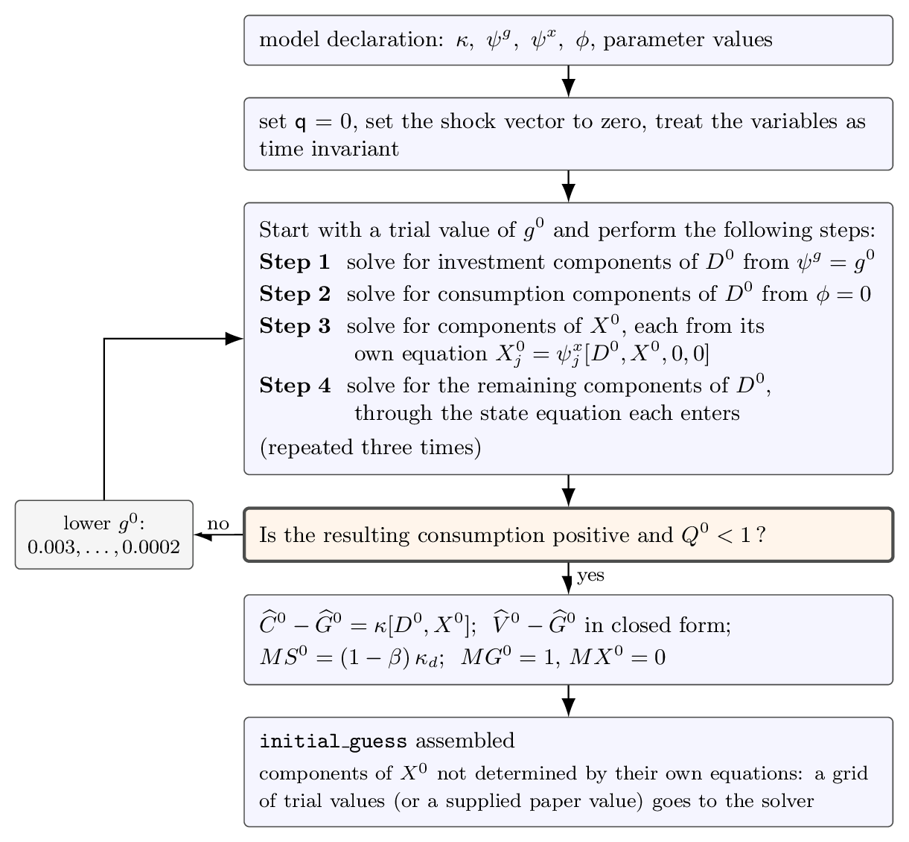
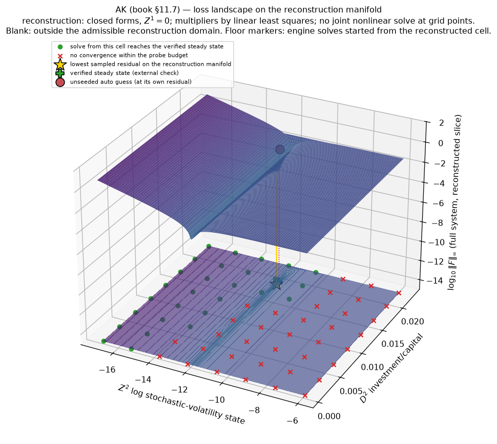
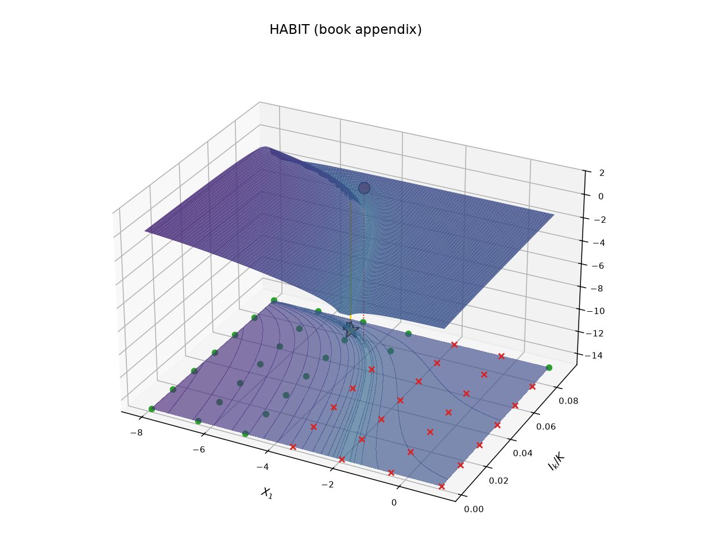
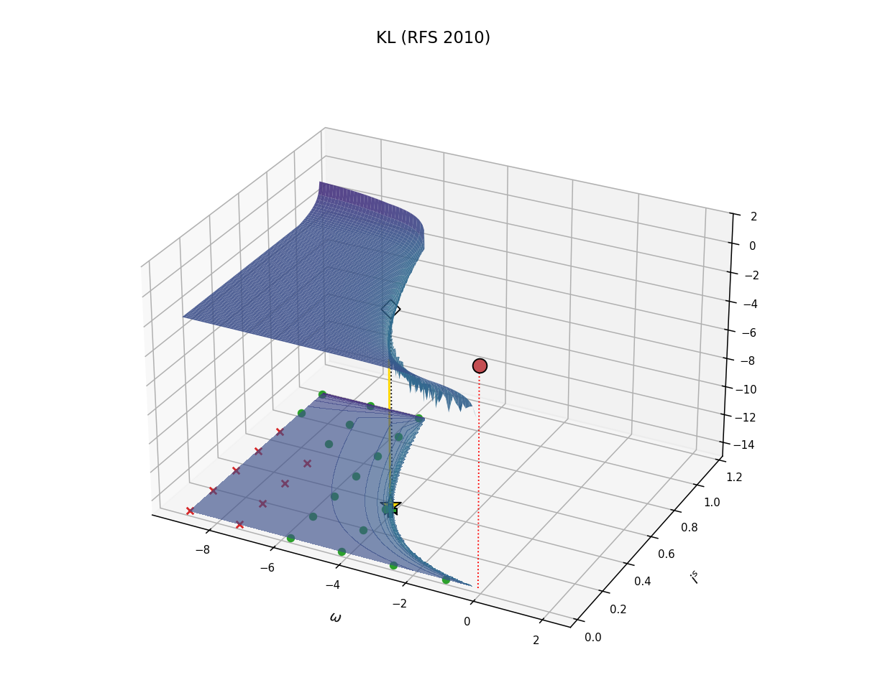
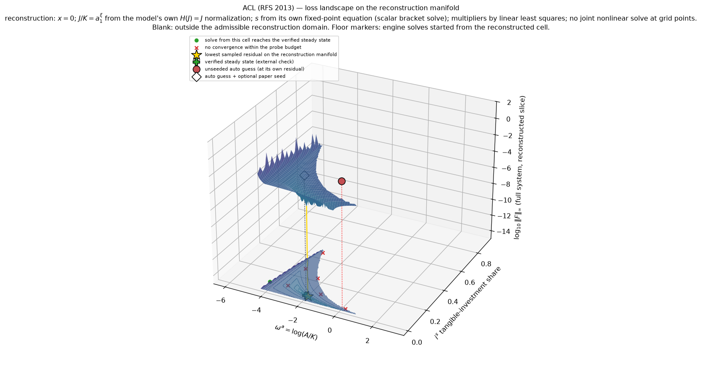
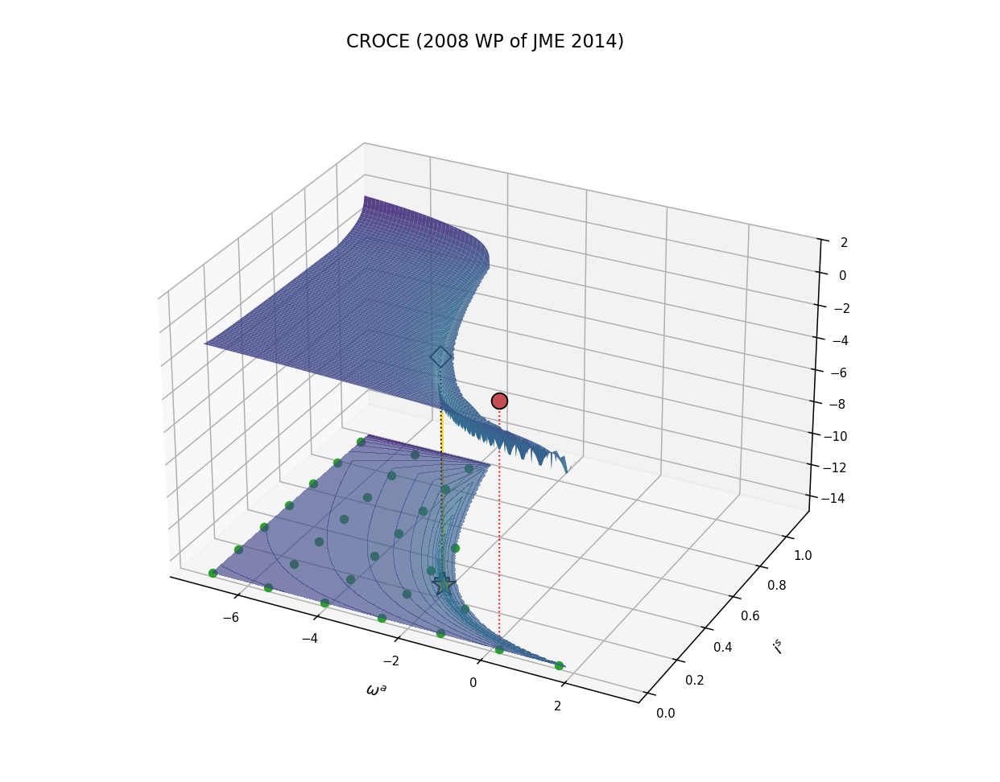
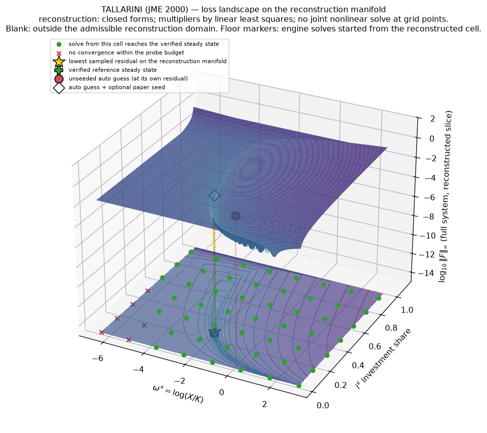

# Automatic Initial Guess and Numerical Validation

`uncertain_expansion` requires an `initial_guess` for its deterministic
steady-state solve. The v2 entry layer constructs that vector from the model
declaration when `initial_guess=None`. The expansion and root-solver
mathematics are unchanged.

The whole algorithm at a glance (source: `support_material/flowchart.tex`):

## 1. Construction in the appendix's notation

We take the model in the notation of the computation appendix:

$$ X_{t+1}(\mathsf q) = \psi^x[D_t(\mathsf q),X_t(\mathsf q),\mathsf qW_{t+1},\mathsf q], $$
$$ \widehat G_{t+1}(\mathsf q)-\widehat G_t(\mathsf q) = \psi^g[D_t(\mathsf q),X_t(\mathsf q),\mathsf qW_{t+1},\mathsf q], $$
$$\widehat C_t(\mathsf q)-\widehat G_t(\mathsf q) = \kappa[D_t(\mathsf q),X_t(\mathsf q)],$$
$$0 =\phi[D_t(\mathsf q),X_t(\mathsf q)]. $$

Set $\mathsf q=0$, set the shock vector to zero, and treat the variables
as time invariant; write $g^0=\widehat G_{t+1}^0-\widehat G_t^0$ for the
trial growth rate (default $0.005$). The construction determines the
steady-state objects one coordinate at a time — every calculation below
is one-dimensional, never a joint system.

**Step 1 — investment components of $D^0$.**
Input: the trial growth rate $g^0$; the current values of the other
components of $D^0$ and of $X^0$.
Output: a common value for the components of $D^0$ that enter $\psi^g$,
solving

$$ \psi^g[D^0,X^0,0,0] = g^0 . $$

**Step 2 — consumption components of $D^0$.**
Input: the components of $D^0$ from Step 1; the current $X^0$.
Output: one still-free component of $D^0$ for each static constraint,
solving

$$ \phi[D^0,X^0]=0 . $$

**Step 3 — components of $X^0$ determined by their own equations.**
Input: the components of $D^0$ from Steps 1–2.
Output: each component of $X^0$, solved from its own steady-state
equation

$$ X_j^0=\psi_j^x[D^0,X^0,0,0] . $$

A component that cancels out of its own equation — typically a ratio of
two trending variables, whose evolution equation determines only its
increment — is not determined here; it is reported and handled in
Section 2.

**Step 4 — remaining components of $D^0$.**
Input: the values from Steps 1–3.
Output: each component of $D^0$ in neither $\psi^g$ nor $\phi$, solved
through the state equation it enters.

The four steps repeat three times. Construct, as in the appendix's
steady state calculations,

$$ Q^0 = \beta\exp\left[(1-\rho)\left(\widehat R^0-\widehat V^0\right)\right] = \beta\exp\left[(1-\rho)\,g^0\right]. $$

If no positive-consumption allocation exists at $g^0$, or $Q^0\ge1$,
we lower $g^0\in\{0.003,0.002,0.001,0.0005,0.0002\}$ and repeat.

**Value entries.**
Input: $(D^0,X^0)$, $g^0$, $Q^0$.
Output: $\widehat C^0-\widehat G^0=\kappa[D^0,X^0]$, and
$\widehat V^0-\widehat G^0$ solving the appendix's steady state
equations

$$ \widehat V^0-\widehat G^0 = \frac{1}{1-\rho}\log\left[(1-\beta)\exp\left[(1-\rho)\left(\widehat C^0-\widehat G^0\right)\right]+\beta\exp\left[(1-\rho)\left(\widehat R^0-\widehat G^0\right)\right]\right], \qquad \widehat R^0-\widehat G^0=\widehat V^0-\widehat G^0+g^0 . $$

The first equation is linear in
$\exp\left[(1-\rho)\left(\widehat V^0-\widehat G^0\right)\right]$, so
for $\rho\ne1$ its solution is

$$ \widehat V^0-\widehat G^0 = \widehat C^0-\widehat G^0 + \frac{1}{1-\rho} \log \frac{1-\beta}{1-Q^0} , $$

which requires $Q^0<1$; for $\rho=1$ the updating is
$\widehat V=(1-\beta)\widehat C+\beta\widehat R$, giving

$$ \widehat V^0-\widehat G^0 = \widehat C^0-\widehat G^0 + \frac{\beta}{1-\beta}\, g^0 . $$

**Multiplier and co-state entries.**
Input: $(D^0,X^0)$.
Output:

$$ MS^0 = (1-\beta)\,\kappa_d[D^0,X^0], $$

the $\kappa_d$ entry of $P^0L^0$ in the first-order conditions
$Q^0H^0+P^0L^0-M^0=0$ — a starting value, not a solved equation — and
$MG^0=1$, $MX^0=0$.

The entries are placed in the `initial_guess` ordering of
`uncertain_expansion`.

| entry | construction |
|---|---|
| $D^0$, components of $X^0$ determined by their own equations, $g^0$, $\widehat C^0-\widehat G^0$, $\widehat V^0-\widehat G^0$, $MS^0$ | model equations |
| components of $X^0$ not determined by their own equations | grid of trial values, or a value supplied by the user |
| $MX^0$, $MG^0$ | set to $0$ and $1$ |

## 2. Solve and acceptance

If a component of $X^0$ cancels out of its own steady-state equation,
we try a grid of trial values for it, constructing all other entries of
`initial_guess` afresh at each value. The user can also supply a
starting value for such a component directly.

We then run the existing root solve of `uncertain_expansion` and report
a solution only when the model equations and the complete compiled
steady-state system hold to within $10^{-6}$. If the target parameter
values do not solve directly, we move one parameter at a time from the
default values, restarting each solve from the previous solution.

In the validation below, the supplied values are the papers' own
steady-state values, and we report the two starting points separately:
a solve without them, checked against the paper, is an independent
check; a solve started from them is a consistency check.

## 3. The steady-state equations over a grid

Each figure varies one component of $X^0$ and one investment component
of $D^0$ over a grid. At every grid point we construct the remaining
entries as in Section 1 and complete the multiplier and co-state entries
by linear least squares — no joint solve is used to construct the
surface. Height and color show the base-10 logarithm of the largest
error in the complete steady-state system at that point.

On the floor, green circles mark grid points from which
`uncertain_expansion` reaches the verified steady state, orange squares
a different solution, and red crosses no convergence within the time
budget. The large markers are ● the constructed `initial_guess` without
supplied values, ◇ the constructed `initial_guess` with a supplied
starting value (here, the paper's), ★ the lowest sampled error, and +
the verified steady state.

*Figure 1a. AK: the error is nearly flat in $Z_2$ and sharply localized
in the investment choice $D_2$; the constructed `initial_guess` solves
without a paper value.*

*Figure 1b. HABIT: the trough links the habit state $X_1$ to the
capital-investment choice; the constructed `initial_guess` reaches the
appendix solution.*

*Figure 1c. KL: the constructed `initial_guess` sits on the flat region;
the optional paper value places the state next to the narrow trough.*

*Figure 1d. ACL: the region where the construction is defined, and the
set of starting points from which the solver reaches the verified steady
state, are both narrow. The attempt without paper values fails within
its time budget; the paper's values are required, and the result is a
consistency check.*

*Figure 1e. Croce: every sampled starting point reaches the same steady
state; the paper's value only speeds up the solve.*

*Figure 1f. Tallarini: most sampled starting points reach the verified
steady state at $\chi=100$; the paper's value is optional.*

The surfaces show the size of the steady-state errors; the floor markers
show where the solver converges. They do not assert convexity. The
grids and outcomes are stored in `support_material/landscape_*.npz` and
reproduced by `support_material/make_landscapes.py`.

## 4. Numerical record

| model | constructed `initial_guess`, no paper values | optional paper value | validation |
|---|---|---|---|
| AK | error $4.0\times10^{-2}$; solves in 2 s | none | independent; anchor error $7.1\times10^{-6}$ |
| HABIT | error $9.3\times10^{-2}$; solves in 12 s | none | appendix replication |
| KL | error $8.8\times10^{-1}$; solves in 27 s | solves in 3 s | independent check without paper values; with them, consistency error $3.3\times10^{-11}$ |
| ACL | error $1.3$; fails, directly and from the grid of trial values | solves in 70 s | consistency only; error $5.0\times10^{-10}$ |
| CROCE | error $3.1\times10^{-1}$; solves in 7 s | solves in 5 s | independent check without paper values; with them, consistency error $1.6\times10^{-11}$ |
| TALLARINI | error $3.3\times10^{-1}$; solves in 2 s | solves in 1 s | independent check without paper values; $\rho$-convention gap $1.9\times10^{-4}$ |

Five of the six economies solve from the constructed `initial_guess`
without paper values. ACL is the exception and is labeled accordingly.
The solved steady state does not depend on the trial value $g^0$:
varying it from $0.001$ to $0.02$ moves the solved AK and KL steady
states by less than $10^{-10}$, and an infeasible value is lowered
automatically. The full record is in `support_material/ablation.json`.
