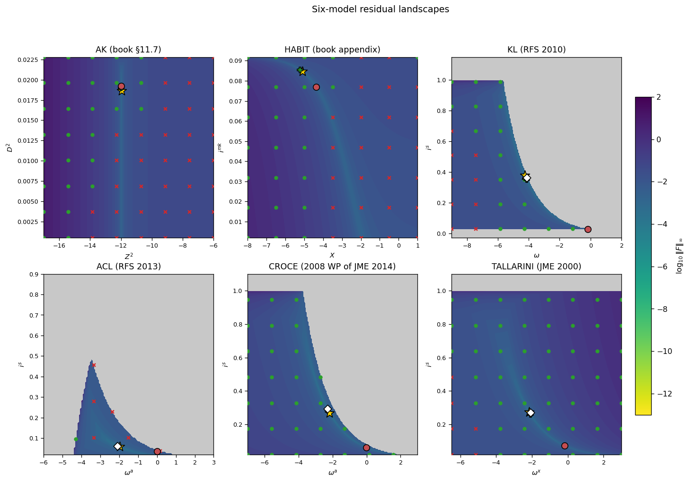

# Automatic Initial Guess: Construction and Numerical Validation

## 1. The problem and the one substantive change

The engine solves the deterministic steady state of a declared economy —
a nonlinear system

$$F_{\mathcal M}(x;\theta)=0$$

— and then expands around it. Upstream, the user must supply the starting
vector $x$ by hand, in the solver's internal ordering. The single
substantive addition of v2 is the **automatic initial guess**: a map

$$G_0:(\mathcal M,\theta)\ \longmapsto\ (x_0,\ \mathcal U,\ \text{feasibility flags})$$

that constructs a feasible, model-consistent starting vector $x_0$ from
the model declaration itself ($\kappa,\ \psi^g,\ \psi^x,\ \phi$ plus the
parameter vector $\theta$), and reports the set $\mathcal U$ of states the
model's own equations cannot pin. Everything else in the driver —
multi-start, optional paper seeds, continuation, acceptance gates — is
auxiliary machinery around $G_0$ or verification of what comes out. The
solver mathematics is untouched.

> **$G_0$ constructs a starting point; it does not solve the system.**
> The nonlinear root solve, and the acceptance decision, are separate
> stages defined in Section 3.

## 2. Construction of $G_0$

Everything is evaluated under the deterministic operator
$\mathcal D_0$: $\mathsf q=0$, $W_{t+1}=0$, $x_{t+1}=x_t$.

**Coordinate-wise passes.** For a candidate growth rate $\bar g$ (default
$0.005$), three groups of one-dimensional equations are solved in
Gauss–Seidel order (scan for a sign change, then Brent's method — never a
joint multi-dimensional solve):

1. **Investment controls** invert the growth equation:
   $\psi^g(u_0,s_0;\theta)=\bar g$.
2. **Consumption controls** absorb the static constraint:
   $\phi_j(u_0,s_0;\theta)=0$.
3. **States** sit at their own deterministic fixed points:
   $\psi^x_j(u_0,s_0;\theta)-s_{0j}=0$.

The passes repeat (three sweeps). If no positive-consumption interior
point exists at $\bar g$, the **growth ladder** lowers
$\bar g\in\{0.005,0.003,0.002,0.001,0.0005,0.0002\}$ and retries: the
guess must be a feasible interior point, nothing more.

**Utility-block entries (closed forms, not solves).** With
$\kappa_0=\kappa(u_0,s_0;\theta)$, the deterministic value recursion has a
closed form:

$$v_0=\frac{1}{1-\rho}\log\!\left[\frac{(1-\beta)e^{(1-\rho)\kappa_0}}{1-\beta e^{(1-\rho)\bar g}}\right],\qquad \rho\neq 1,$$

valid only under the transversality condition $\beta e^{(1-\rho)\bar g}<1$;
for $\rho=1$: $v_0=\kappa_0+\frac{\beta}{1-\beta}\bar g$. The
static-constraint multiplier is initialized by the envelope condition
$m_s^0=(1-\beta)\,\partial\kappa/\partial c\,(u_0,s_0)$.

**The three classes of coordinates.**

| class | coordinates | origin |
|---|---|---|
| **derived from the model's equations** | controls, self-pinning states, $\bar g$, $\kappa_0$, $v_0$, $m_s^0$ | the passes and closed forms above |
| **unpinned** ($\mathcal U$) | ratio states whose own law of motion cancels (e.g. $\log(Z/K)$): only the Euler equation fixes their scale | handed to multi-start (Section 3) |
| **normalized initial values** | growth costate $m_g=1$, other costates $=0$ | conventions, not equation-derived |

## 3. The driver around $G_0$

For the unpinned coordinates the driver forms a **candidate set**

$$
\mathcal C_{\mathcal M}
=
\left\{
G_0(\mathcal M,\theta;u):u\in\Gamma(\mathcal U)
\right\},
$$

$\Gamma(\mathcal U)$ a fixed grid of pinned values, re-deriving the whole
guess at each grid point so all other entries stay consistent with it
(10-minute budget). Only then comes the solve and the acceptance test:

$$
x^\star
=
\mathrm{Root}\left(F_{\mathcal M},x_0\right),
\qquad
\left\|F_{\mathcal M}(x^\star)\right\|_\infty
<
\tau,
\quad
\tau=10^{-6},
$$

where $\mathrm{Root}$ is the engine's own globalized Newton solve
(unchanged), and acceptance requires **both** residual gates — the model's
deterministic equations and the engine's complete steady-state system.
The gates certify **convergence, not specification**: both evaluate the
same compiled system the solver just solved, so a mis-assembled system
(a model outside the engine's constraint class) can converge to a point
that passes both. That is why every model in the validation below also
carries anchors from its own paper.

**Optional paper seed — a comparator, not part of $G_0$.** Where a paper
provides closed-form steady-state values, they may be passed as overrides
for $\mathcal U$. A seed changes nothing in the construction; it replaces
the multi-start search over $\Gamma(\mathcal U)$ by the paper's own value.
Results obtained with a seed are **consistency checks against that
paper**; results obtained cold and then compared to the paper's closed
forms are **independent checks**. The two are labeled separately
everywhere below.

**Continuation** (for hard preference targets): one parameter axis at a
time from the model's defaults, bisecting the step on failure,
warm-starting each solve from the previous solution.

## 4. Numerical geometry: what $G_0$ has to find

For each model a **reconstruction map** $R_{\mathcal M}(z_1,z_2)$ takes
the two fragile coordinates (the endogenous ratio state and the investment
margin — the directions only the Euler equation can pin) and rebuilds
every other coordinate from the model's own equations: remaining controls
from the static constraint, self-pinning states at their own fixed points,
the value ratio from the deterministic recursion in closed form, the
multipliers by one linear least-squares step (the first-order-condition
block is linear in them). No joint nonlinear solve is performed at any
grid point. The plotted surface is

$$
L_{\mathcal M}(z_1,z_2)
=
\log_{10}
\left\|
F_{\mathcal M}\left(R_{\mathcal M}(z_1,z_2)\right)
\right\|_\infty .
$$

so the only residual left on the manifold is the Euler incompatibility —
the thing the solver actually has to resolve. Blank cells are **outside
the admissible reconstruction domain** (negative consumption, or the
value recursion undefined because the transversality margin is negative);
they are properties of the candidate slice, not statements that the model
has no solution.

**Common visual key.** The surface height and color both report
$\log_{10}\|F\|_\infty$ on a common scale. On the floor, green circles
reach the verified steady state, orange squares reach another root, and
red crosses do not converge within the probe budget. The large markers
are ● unseeded $G_0$, ◇ optional paper seed, ★ lowest sampled residual,
and + verified reference steady state.

*Figure 1. Six-model overview. Each panel is a top-down view of the same
surface shown below. Gray denotes points outside the admissible
reconstruction domain; the floor probes provide the empirical
attraction-basin evidence.*

*Figure 2a. AK economy. The low-residual trough is narrow in the investment
direction and comparatively flat in the stochastic-volatility state. The
unseeded construction solves without a paper seed and improves on the
book's legacy hand-built starting vector.*

*Figure 2b. Habit economy. The diagonal trough links the habit stock to
capital investment. Green and red floor probes expose the attraction
boundary, while the unseeded construction reaches the book-replication
steady state without an external seed.*

*Figure 2c. Kaltenbrunner–Lochstoer economy. The admissible domain has a
curved boundary and a sharp Euler-compatible valley. The cold guess starts
on the plateau but still solves; the optional paper seed moves the starting
point close to the valley.*

*Figure 2d. Ai–Croce–Li economy. The two-capital model has the thinnest
admissible region and the smallest sampled attraction basin. The cold
construction fails within budget, whereas the paper-derived seed reaches
the verified solution; this panel is therefore a consistency check rather
than an independent discovery.*

*Figure 2e. Croce economy. The reconstructed surface contains a broad,
connected attraction basin: every sampled admissible starting point
reaches the same steady state. The paper seed is an accelerator, not a
requirement.*

*Figure 2f. Tallarini economy. Most sampled points lie in the verified
basin even at risk aversion $\chi=100$. The cold construction solves
quickly, and the closed-form seed is optional.*

The surface shows numerical geometry; the floor probes show attraction.
This follows the same instinct as examining objective geometry in convex
optimization, but it is **not** a claim that these nonlinear systems are
convex.

Figures, grids, and probe outcomes are fully reproducible from
`support_material/make_landscapes.py`; the sampled surfaces and probe
records are frozen in `support_material/landscape_*.npz`.

## 5. Numerical validation

**Cold vs seed-assisted, per model** (600 s budget; "initial residual" is
$\|F\|_\infty$ at the starting vector before any solve; full record in
`support_material/ablation.json`):

| model | configuration | initial $\|F\|_\infty$ | solve | time | final residual |
|---|---|---:|---|---:|---:|
| AK | legacy hand guess | 1.5e+00 | OK | 7 s | 6.7e-16 |
| AK | auto guess only | 4.0e-02 | OK | 2 s | 1.6e-13 |
| AK | auto + multi-start | — | OK | 3 s | 1.6e-13 |
| AK | full automatic layer | — | OK | 3 s | 1.6e-13 |
| HABIT | auto guess only | 9.3e-02 | OK | 12 s | 1.1e-11 |
| HABIT | auto + multi-start | — | OK | 12 s | 1.1e-11 |
| HABIT | full automatic layer | — | OK | 12 s | 1.1e-11 |
| KL | auto guess only | 8.8e-01 | OK | 27 s | 1.1e-12 |
| KL | auto + multi-start | — | OK | 27 s | 1.1e-12 |
| KL | auto + paper seed | 6.8e-02 | OK | 3 s | 6.2e-13 |
| KL | full automatic layer | — | OK | 4 s | 6.2e-13 |
| ACL | auto guess only | 1.3e+00 | failed (rejected) | 370 s | — |
| ACL | auto + multi-start | — | failed (budget) | 2229 s | — |
| ACL | auto + paper seed | 2.7e-01 | OK | 70 s | 1.3e-12 |
| ACL | full automatic layer | — | OK | 72 s | 1.3e-12 |
| CROCE | auto guess only | 3.1e-01 | OK | 7 s | 1.3e-13 |
| CROCE | auto + multi-start | — | OK | 8 s | 1.3e-13 |
| CROCE | auto + paper seed | 6.0e-02 | OK | 5 s | 5.8e-14 |
| CROCE | full automatic layer | — | OK | 5 s | 5.8e-14 |
| TALLARINI | auto guess only | 3.3e-01 | OK | 2 s | 3.0e-12 |
| TALLARINI | auto + multi-start | — | OK | 2 s | 3.0e-12 |
| TALLARINI | auto + paper seed | 8.5e-02 | OK | 1 s | 5.0e-13 |
| TALLARINI | full automatic layer | — | OK | 2 s | 5.0e-13 |

**Reading.** Five of the six economies solve **cold** — the constructed
guess alone, 2–27 s each — including AK, the one model with a legacy
hand-built guess, which the construction beats (2 s vs 7 s). The paper
seed is decisive exactly once: the two-capital, three-state ACL model,
where the unseeded constructions fail and the seed solves it in 70 s.
So the capability is the constructed guess; seeds are accelerators —
except for ACL, where the seed is genuinely needed and is credited.

**Anchors, per model** (each accepted solution is compared against
steady-state restrictions from the paper itself; the type column says
what the comparison proves):

| model | target | anchor | type | error |
|---|---|---|---|---|
| AK | γ=8.001 | closed-form D2* = 0.019023 (ρ=1) | independent (cold solve) | 7.1e-06 (ρ=1.001 convention) |
| HABIT | γ=8, λ=.67, τ=.01 | appendix notebook's stored solution | book replication | machine precision |
| KL | γ=5, ρ=2/3 | paper's closed forms (fn. 4 + Euler) | independent when cold; consistency when seeded | 3.3e-11 |
| ACL | γ=10, ρ=0.5 | Borovička–Hansen closed-form chain | **consistency only (seed required)** | 5.0e-10 |
| CROCE | γ=30, ρ=0.5 | growth / I-K / Euler identities | independent when cold; consistency when seeded | 1.6e-11 |
| TALLARINI | χ=γ=100, ρ≈1 | growth / I-K / Euler identities | independent when cold; consistency when seeded | 1.9e-04 (ρ-convention gap) |

**Extreme risk aversion.** Nothing in the mathematics binds for these
calibrations: the first-order $\mu_0$ iteration converges from every
probed initialization at every $\gamma\le 300$; the risk-adjustment
covariance stays positive definite through $\gamma=400$; and $|\mu^0|$
grows **linearly** in $\gamma$ (slope ≈ 0.173 for ACL), exactly as the
theory's $\mu^0\propto(\gamma-1)$ predicts. Historical "extreme aversion
failures" trace to starting points (the job of $G_0$) and to fixed
solve-time budgets on large models — with a 90 s budget, ACL at
$\gamma\ge150$ times out although the iteration converges (179 s at
$\gamma=150$ with a 600 s budget).

## 6. Known limitations

1. $\bar g$ and its ladder are heuristics; the equal-investment closing
   rule for extra capitals is a heuristic. Any feasible interior growth
   target works; none is "the" right one.
2. Unpinned ratio states genuinely require multi-start or a seed: their
   scale is invisible to every one-dimensional pass. For ACL
   (three states, two of them ratio-like) the multi-start grid fails
   within budget and the paper seed is required.
3. **The residual gates certify convergence, not specification.** What
   protects against a mis-assembled system is the engine's model-class
   requirement (the resource constraint in output-share form) plus the
   per-paper anchors — a modeling requirement and an external check, not
   an internal gate.
4. Results seeded by a paper's closed forms are consistency checks
   against that paper, not independent validation; the tables above label
   every number accordingly.
5. Solve-time budgets must scale with model size; a fixed budget
   masquerades as a mathematical failure (the ACL γ ≥ 150 case above).
