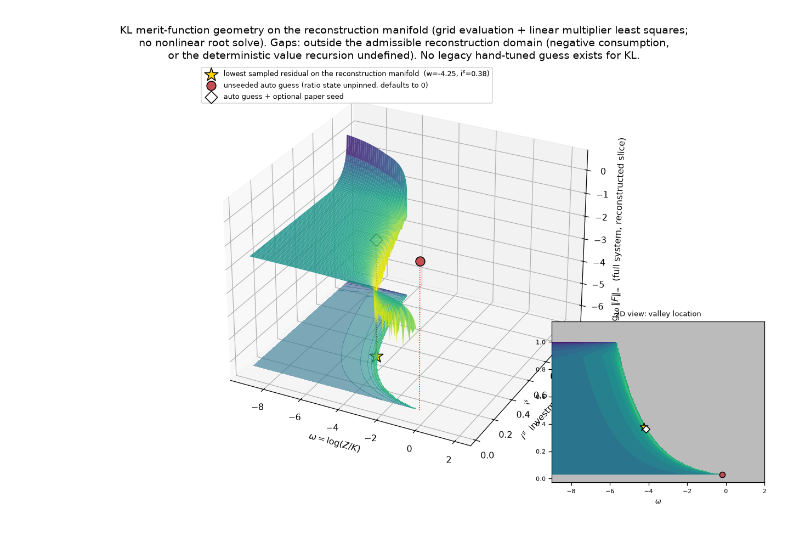

# Numerical validation

Three exhibits: the merit-function geometry of one model (KL), the
six-model anchor record, and an ablation that separates what each stage of
the automatic layer contributes.

## 1. The merit-function geometry (KL)

**What the figure is.** The engine's complete steady-state residual
$\log_{10}\|F\|_\infty$ evaluated on a two-dimensional slice through the
candidate space: axes are the endogenous ratio state
$\omega=\log(Z/K)$ and the investment share $i^s$; every other coordinate
is rebuilt at each grid point by the model's own closed-form algebra plus
**one linear least-squares step for the multipliers** — grid evaluation
only, **no nonlinear root solve**. Produced by
`support_material/kl_findbasin.py`; grid data in
`support_material/kl_basin_grid.npz`.

**How to read it.**
- The curved valley is the set of Euler-compatible candidates; the
  remaining residual on this slice is exactly the Euler incompatibility.
- ★ = the lowest sampled residual on the reconstruction manifold, at
  $(\omega, i^s) = (-4.25, 0.38)$ — one grid cell from the paper's
  closed-form steady state $(-4.1256, 0.3506)$, which is used here only as
  an external check.
- ● = the unseeded auto guess (the ratio state is unpinned and defaults to
  0, far up on the plateau). ◇ = the auto guess with the paper's optional
  closed-form seed, at the valley's rim.
- Gaps are **outside the admissible reconstruction domain** (negative
  consumption, or the deterministic value recursion undefined because the
  transversality margin is negative there). They are properties of the
  candidate slice, not statements that the model has no solution.
- No legacy hand-tuned guess appears for KL because none exists: the
  book's hand-built vector is specific to its AK model — which is the
  motivation for constructing starting points from the model itself.

This figure shows the numerical geometry of a nonlinear system — a
plateau, a narrow low-residual valley, and domain gaps. It is **not** a
claim that the problem is convex; it is the reason initialization and
globalization matter.

## 2. Six-model anchor record

All six economies solve at their published preference targets; each
solution passes both residual gates and is compared against anchors.
"Independent" anchors do not reuse any seeded value.

| model | target | anchor | type | error |
|---|---|---|---|---|
| AK (book §11.7) | γ=8.001 | closed-form D2* = 0.019023 (ρ=1) | independent | 7.1e-06 (ρ=1.001 convention) |
| HABIT (book appendix) | γ=8, λ=.67, τ=.01 | appendix notebook's stored solution | book-internal | machine precision (earlier record) |
| KL (RFS 2010) | γ=5, ρ=2/3 | paper's closed forms (fn. 4 + Euler) | consistency (seeded) | 3.3e-11 |
| ACL (RFS 2013) | γ=10, ρ=0.5 | Borovička–Hansen closed-form chain | consistency (seeded) | 5.0e-10 |
| CROCE (2008 WP of JME 2014) | γ=30, ρ=0.5 | growth/I-K/Euler identities | consistency (seeded) | 1.6e-11 |
| TALLARINI (JME 2000) | χ=γ=100, ρ≈1 | growth/I-K/Euler identities | consistency (seeded) | 1.9e-04 (ρ-convention gap) |

Genuinely independent checks beyond AK: under the proposed C1 prototype
(see `MODIFICATIONS.md`), steady-state labor — a solved control never
seeded — hits the authors' calibration targets: Tallarini χ=1 ⇒ N=0.2304
(his 0.2305), Croce (JME 2014) baseline ⇒ N=0.180000 (his 0.18).

Robustness batteries (recorded earlier in the notebook): 22/22
correlation-structure cells; order-0 steady states identical digit-for-digit
across Σ structures and under rotations Σ→ΣQ; |μ⁰| moves with the
correlations. At extreme risk aversion nothing in the mathematics binds
for these calibrations: the first-order μ₀ iteration converges from every
probed initialization at every γ ≤ 300, λ_min of the risk-adjustment
covariance stays ≈ 1 through γ = 400, and |μ⁰| grows linearly in γ
(slope ≈ 0.173, ACL) exactly as the theory's μ⁰ ∝ (γ−1) predicts. The one
practical caveat is budget scaling: with a 90 s per-solve budget, ACL at
γ ≥ 150 times out although the iteration converges (179 s at γ=150 with a
600 s budget) — an engineering artifact, not a mathematical failure.

## 3. Ablation: what each stage contributes

Configurations per model (600 s budget throughout; "initial residual" is
$\|F\|_\infty$ at the starting vector before any solve):

- **legacy hand guess** — the book's hand-built vector (exists only for AK);
- **auto guess only** — constructed vector, single solve, no restarts;
- **auto + multi-start** — adds grid restarts over unpinned states;
- **auto + paper seed** — constructed vector with the paper's closed form;
- **full automatic layer** — everything, including continuation from defaults.

| model | configuration | initial $\|F\|_\infty$ | solve | time | final residual |
|---|---|---:|---|---:|---:|
| AK | legacy hand guess | 1.5e+00 | OK | 7 s | 6.7e-16 |
| AK | auto guess only | 4.0e-02 | OK | 2 s | 1.6e-13 |
| AK | auto + multi-start | — | OK | 3 s | 1.6e-13 |
| AK | full automatic layer | — | OK | 3 s | 1.6e-13 |
| HABIT | auto guess only | 9.3e-02 | OK | 12 s | 1.1e-11 |
| HABIT | auto + multi-start | — | OK | 12 s | 1.1e-11 |
| HABIT | full automatic layer | — | OK | 12 s | 1.1e-11 |
| KL | auto guess only | 8.8e-01 | OK | 27 s | 1.1e-12 |
| KL | auto + multi-start | — | OK | 27 s | 1.1e-12 |
| KL | auto + paper seed | 6.8e-02 | OK | 3 s | 6.2e-13 |
| KL | full automatic layer | — | OK | 4 s | 6.2e-13 |
| ACL | auto guess only | 1.3e+00 | failed (rejected) | 370 s | — |
| ACL | auto + multi-start | — | failed (budget) | 2229 s | — |
| ACL | auto + paper seed | 2.7e-01 | OK | 70 s | 1.3e-12 |
| ACL | full automatic layer | — | OK | 72 s | 1.3e-12 |
| CROCE | auto guess only | 3.1e-01 | OK | 7 s | 1.3e-13 |
| CROCE | auto + multi-start | — | OK | 8 s | 1.3e-13 |
| CROCE | auto + paper seed | 6.0e-02 | OK | 5 s | 5.8e-14 |
| CROCE | full automatic layer | — | OK | 5 s | 5.8e-14 |
| TALLARINI | auto guess only | 3.3e-01 | OK | 2 s | 3.0e-12 |
| TALLARINI | auto + multi-start | — | OK | 2 s | 3.0e-12 |
| TALLARINI | auto + paper seed | 8.5e-02 | OK | 1 s | 5.0e-13 |
| TALLARINI | full automatic layer | — | OK | 2 s | 5.0e-13 |

**Reading.** The constructed guess alone suffices for five of the six
economies (2–27 s each), including AK, where it also beats the book's
legacy hand guess (2 s vs 7 s). Multi-start and continuation add nothing
at these particular targets (their value shows on other cases — unpinned
single-state models from wider windows, and hard preference paths). The
paper seed is decisive exactly once: the two-capital, three-state ACL
model, where the unseeded constructions fail and the seed solves it in
70 s — so the seed's contribution is real, isolated, and correctly
attributed.

Reading the table: the columns separate what the constructed guess itself
contributes, what multi-start adds for unpinned states, what the optional
paper seed adds, and whether continuation is ever needed at these targets.
This prevents attributing the seed's contribution to the constructed guess.
